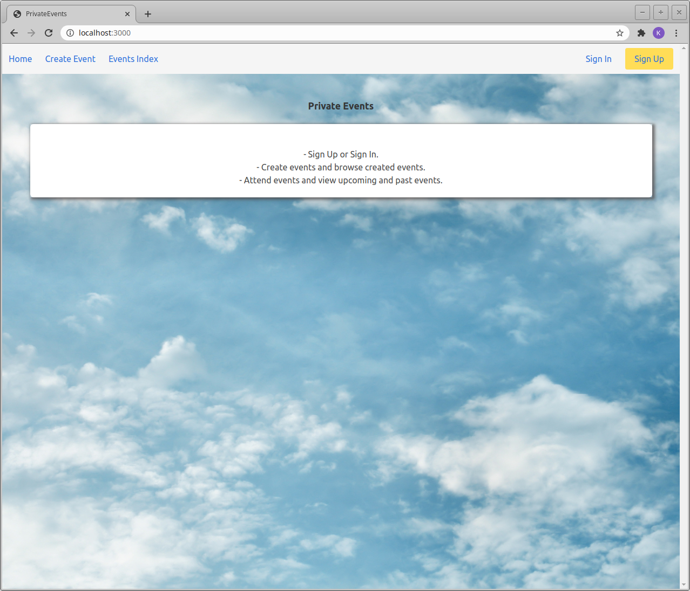

# Private Events

A website for creating and attending events.  
You can view the live server running here: https://immense-river-79465.herokuapp.com/.

## What I Learned

This purpose of building this website was to get exposure to working with advanced forms and to further my understanding of associations. In this project a user can create events, attend many events, and an event can be attended by many users. This required me to model many-to-many relationships and to specify my foreign keys and class names. Creating the "user" model and the "event" model was routine, but creating the "attending" model and establishing a "through" table was a learning experience. By establishing this relationship I was able to do things such as "@event.attendees". I then also learned about using scopes to make my code a bit cleaner and faster to write.

An extra learning process that I took upon myself was getting the project deployed on Heroku. I was familiar with deploying to Heroku, but I was not confident on switching the SQLite3 database to PostgreSQL. However, all it took was a few Google searches on how PostgreSQL worked, installing it locally, and switching some Rails files and it was up and running! I also now know that if I plan to deploy to Heroku in the future, it is best to make that decision when starting a project, and adding on PostgreSQL to the terminal command, such as: `$ rails new myapp --database=postgresql`.

Styling was not the main focus of the project, but I decided to add a bit of scss to the website to make it presentable and I learned more about working with <a href="https://rubygems.org/gems/bulma-rails">bulma-rails</a> and making a website responsive.

### Gem List

- <a href="https://rubygems.org/gems/bulma-rails">bulma-rails</a>
- <a href="https://rubygems.org/gems/simple_form">simple_form</a>
- <a href="https://rubygems.org/gems/htmlbeautifier">htmlbeautifier</a>

### Homepage
